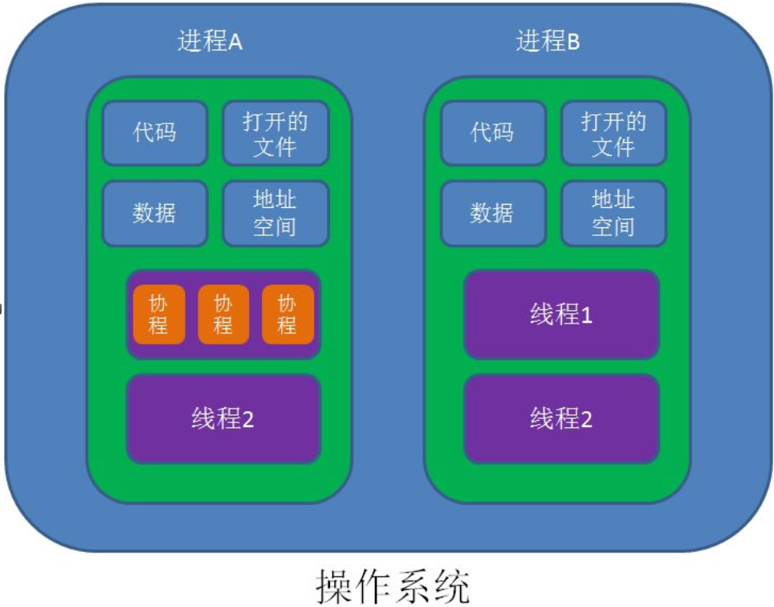

## 简介

协程，英文Coroutines，是一种基于线程之上，但又比线程更加轻量级的存在，这种由程序员自己写程序来管理的轻量级线程叫做『用户空间线程』，具有对内核来说不可见的特性。

因为是自主开辟的异步任务，所以很多人也更喜欢叫它们**纤程**（Fiber），或者绿色线程（GreenThread）。正如一个进程可以拥有多个线程一样，一个线程也可以拥有多个协程。

## 协程的目的

在传统的J2EE系统中都是基于**每个请求占用一个线程去完成完整的业务逻辑（**包括事务）。所以系统的吞吐能力取决于每个线程的操作耗时。如果遇到很耗时的I/O行为，则整个系统的吞吐立刻下降，因为这个时候线程一直处于阻塞状态，如果线程很多的时候，会存在很多线程处于空闲状态（等待该线程执行完才能执行），造成了资源应用不彻底。

还有就是在游戏中，英雄对敌人释放一个技能，该技能有飞行过程，游戏是每帧计算，然后暂停去处理其他逻辑，技能要改逻辑时也更方便。

最常见的例子就是JDBC（它是同步阻塞的），这也是为什么很多人都说数据库是瓶颈的原因。这里的耗时其实是让CPU一直在等待I/O返回，说白了线程根本没有利用CPU去做运算，而是处于空转状态。而另外过多的线程，也会带来更多的ContextSwitch开销。

对于上述问题，现阶段行业里的比较流行的解决方案之一就是**单线程加上异步回调**。其代表派是node.js以及Java里的新秀Vert.x。

而协程的目的就是当出现长时间的I/O操作时，通过**让出目前的协程调度，执行下一个任务**的方式，来消除ContextSwitch上的开销。

 

## 协程的特点

1. 线程的切换由操作系统负责调度，协程由用户自己进行调度，因此减少了上下文切换，提高了效率。
2. 线程的默认Stack大小是1M，而协程更轻量，接近1K。因此可以在相同的内存中开启更多的协程。
3. 由于在同一个线程上，因此**可以避免竞争关系而使用锁**。
4. 适用于被阻塞的，且需要大量并发的场景。但不适用于大量计算的多线程，遇到此种情况，更好实用线程去解决。

 

## 协程的原理

当出现IO阻塞的时候，由协程的调度器进行调度，通过将数据流立刻yield掉（主动让出），并且记录当前栈上的数据，阻塞完后立刻再通过线程恢复栈，并把阻塞的结果放到这个线程上去跑，这样看上去好像跟写同步代码没有任何差别，这整个流程可以称为coroutine，而跑在由coroutine负责调度的线程称为Fiber。比如Golang里的 go关键字其实就是负责开启一个Fiber，让func逻辑跑在上面。

由于协程的暂停完全由程序控制，发生在用户态上；而线程的阻塞状态是由操作系统内核来进行切换，发生在内核态上。

因此，协程的开销远远小于线程的开销，也就没有了ContextSwitch上的开销。

 

| **比较项** | **线程**                                                     | **协程**                                                     |
| ---------- | ------------------------------------------------------------ | ------------------------------------------------------------ |
| 占用资源   | 初始单位为1MB,固定不可变                                     | 初始一般为 2KB，可随需要而增大                               |
| 调度所属   | 由 OS 的内核完成                                             | 由用户完成                                                   |
| 切换开销   | 涉及模式切换(从用户态切换到内核态)、16个寄存器、PC、SP...等寄存器的刷新等 | 只有三个寄存器的值修改 - PC / SP / DX.                       |
| 性能问题   | 资源占用太高，频繁创建销毁会带来严重的性能问题               | 资源占用小,不会带来严重的性能问题                            |
| 数据同步   | 需要用锁等机制确保数据的一直性和可见性                       | 不需要多线程的锁机制，因为只有一个线程，也不存在同时写变量冲突，在协程中控制共享资源不加锁，只需要判断状态就好了，所以执行效率比多线程高很多。 |

 

## 个人总结

- 线程跑起来之后程序员就无法控制线程运行函数的执行了， 
- 有栈协程与无栈协程是协程的两种实现方式，这里的栈是“逻辑栈”，不是内存栈
- 协程不是线程框架，协程出现的比线程早
- 协程不仅能用于互联网，能用于UI，逻辑模拟，异构设备调用，加速

## 参考文档

1. [Lua 协同程序(coroutine)](https://www.runoob.com/lua/lua-coroutine.html)
2. [一文读懂什么是进程、线程、协程](https://www.cnblogs.com/Survivalist/p/11527949.html)